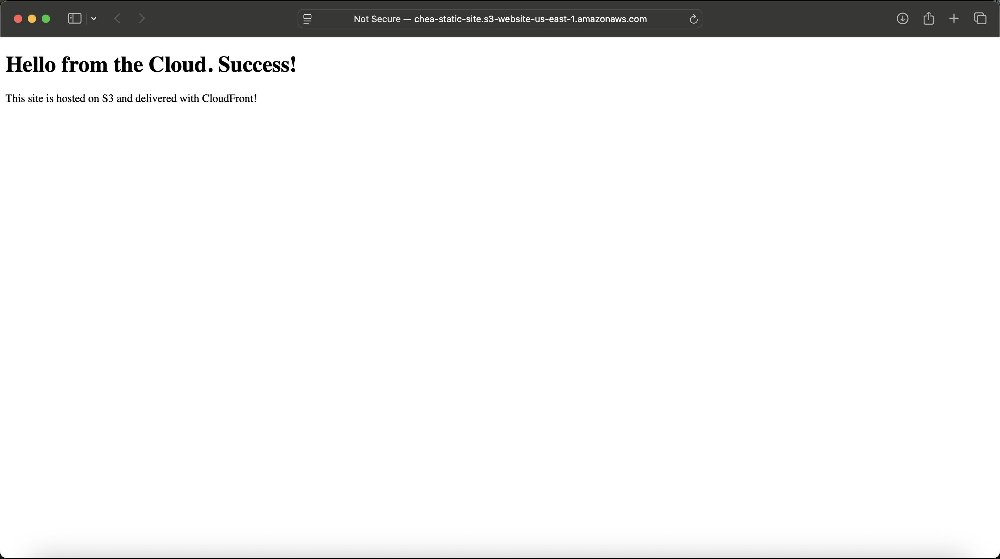

# 🌐 S3 Static Website with CloudFront

This project demonstrates how to host a static website on Amazon S3 and deliver it globally using CloudFront. It includes configuring S3 permissions, enabling static hosting, and securing public access using bucket policies.

## ✅ Features
- Static website hosting with S3
- CloudFront distribution for fast global delivery
- Secure public access using custom bucket policy
- Live deployment demo

## 🔐 Technologies Used
- AWS S3
- AWS CloudFront
- Bucket Policies
- Public Access Controls

## 🛠️ Commands Used

```bash
mkdir s3-static-site
cd s3-static-site
nano index.html
aws s3 mb s3://your-bucket-name
aws s3 website s3://your-bucket-name --index-document index.html
aws s3 cp index.html s3://your-bucket-name
# S3 Static Website Project

This project hosts a static website using AWS S3 and delivers it to the internet.

## Demo



